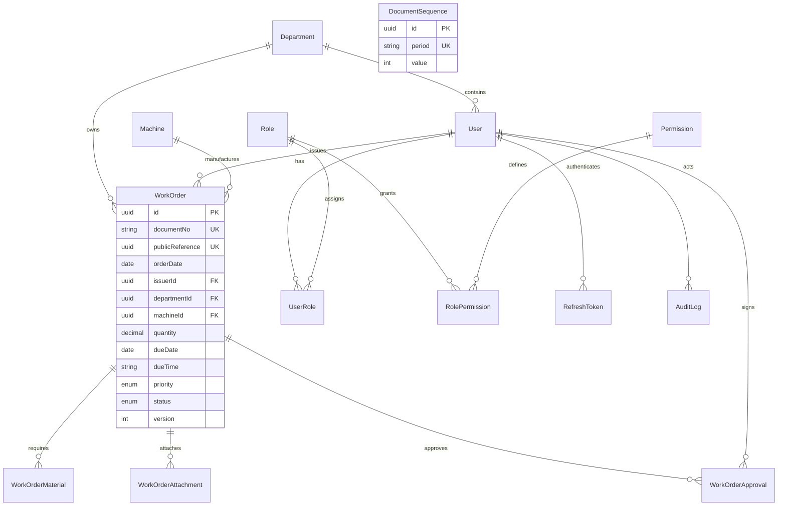

# ATS Company Platform — architecture and implementation plan

## Requirements and scope

Deliver a real Thai-first Temporary Work Order module. PostgreSQL is the source of truth; no mocked business data or local-storage work orders. Future ERP navigation is visible but disabled. External deployments require the owner's Vercel, Render, Neon and object-storage configuration.

## Architecture

Modular monolith in a pnpm monorepo: `apps/web` (Next.js App Router), `apps/api` (NestJS REST), `packages/types` (shared contracts/workflow labels), `packages/config` (strict TypeScript), `packages/eslint-config` (lint rules). Independent Nest modules own authentication, users, roles, departments, machines, work orders, documents, audit and storage. Services own business rules; controllers validate and dispatch. Prisma is the typed data access layer.

Access JWT stays in browser memory. Refresh JWT is rotated in an HttpOnly cookie and only its SHA-256 digest is persisted. Cookie paths, CORS and Origin checks limit cross-site writes. All protected API operations load current permissions from the database. Issuers may mutate/print their own drafts only; supervisors and approvers must be assigned to the document. Admin may operate any document. Draft deletion is soft cancellation so audit history survives.

Work order changes, conditional status updates, approvals and audit events are atomic transactions. Monthly sequence increments use PostgreSQL atomic UPSERT within the creation transaction; UUID identity is separate from unique document number. Editable documents are DRAFT only. Review is two steps through the same supervisor-review endpoint: accept SUBMITTED → SUPERVISOR_REVIEW, then review → WAITING_APPROVAL. Rejected documents are immutable and can be duplicated into a new draft.

Files use an injectable S3-compatible adapter (RustFS locally; S3/R2 in production), private keys and short-lived signed downloads. PostgreSQL stores metadata only. PDFs use Chromium HTML rendering, bundled Sarabun Thai fonts, A4 CSS and authenticated QR links. PDF output and signed file access enforce API permissions.

## ERD



All dates are Gregorian in storage. The order date determines the year/month document-number prefix; monthly sequences use atomic UPSERT and existing document numbers remain stable on edits. Bangkok business dates determine dashboard due dates. Thai display may use Buddhist years. Database checks enforce positive production quantity and nonnegative material quantities. Audit records are append-only with database triggers.

## Folder structure

```text
apps/api/{prisma,src/{common,modules/{auth,users,roles,departments,machines,work-orders,documents,audit,storage}},test}
apps/web/src/{app,components/{ui,work-orders},lib}
packages/{types,config,eslint-config}
docs/
scripts/
```

## Implementation sequence and verification

1. Workspace/tooling → schema → SQL migration → environment-driven seed.
2. Authentication/rotation → permission guards → master data.
3. CRUD/list filters/pagination → sequence/workflow/approval/audit transactions.
4. Storage validation → Thai A4 PDF service.
5. ERP shell → login → dashboard → list → form/materials → details/timeline/actions.
6. Strict typecheck/lint/build; unit workflow tests; PostgreSQL integration tests for concurrent numbering, roles/ownership, refresh rotation, upload/PDF and end-to-end lifecycle; browser checks where available.
7. Docker Compose and Vercel/Render/Neon deployment instructions and configuration.

## Decisions and limits

There was no visual reference image in the attachment; the UI follows the supplied navy/white/red industrial ERP description. Assignments are selected at creation and locked after submission. No public company data, ERP scheduling, accounting, inventory or HR functionality is added. Production seeds never create sample work orders. Secrets are required through environment variables and never checked in.
